<!-- contribution heatmap: real data, boxes reveal cell by cell
     auto-regenerated daily by .github/workflows/update-profile-art.yml -->

<h3><code>aditya@github ~ $ ./contributions.sh</code></h3>

 
 

<!-- terminal layout: ASCII portrait (types in) beside neofetch-style info card
     regenerate portrait: python scripts/prep_photo.py <photo>
     then:               python scripts/make_ascii_svg.py
     regenerate card:    python scripts/make_info_card.py -->

<h3><code>aditya@github ~ $ whoami</code></h3>

<table>
<tr>
<td valign="top"></td>
<td valign="top"></td>
</tr>
</table>

