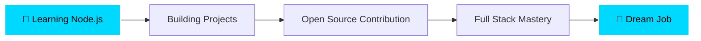

# 🚀 Welcome to Aditya's Digital Universe

<div align="center">
  
</div>

<div align="center">
  
</div>

## 🎯 About Me

```javascript
const aditya = {
  pronouns: "he/him",
  location: "India 🇮🇳",
  currentFocus: "Node.js & Backend Development",
  passions: ["Clean Code", "Problem Solving", "Open Source"],
  motto: "Code is poetry written in logic ✨"
};

console.log(`Hello World! I'm ${aditya.currentFocus} developer`);
```

<div align="center">
  
</div>

## 🛠️ Tech Arsenal

<div align="center">

### Languages & Frameworks


### Tools & Technologies


</div>

## 📊 GitHub Analytics

<div align="center">
  
  
</div>

## 🎯 Current Journey


```mermaid
graph LR
    A[🎯 Learning Node.js] --> B[Building Projects]
    B --> C[Open Source Contribution]
    C --> D[Full Stack Mastery]
    D --> E[🚀 Dream Job]
    
    style A fill:#00D9FF,stroke:#ffffff,stroke-width:2px,color:#000000
    style E fill:#00D9FF,stroke:#ffffff,stroke-width:2px,color:#000000
```

## 🌟 What I'm Up To

<table>
<tr>
<td valign="top" width="50%">

### 🔥 Currently Learning
- 🟢 **Node.js** - Building robust backend applications
- 🔗 **Express.js** - Web application framework
- 🗄️ **Database Management** - MongoDB & SQL
- 🔐 **Authentication** - JWT & OAuth
- 🐳 **Docker** - Containerization basics

</td>
<td valign="top" width="50%">

### 🎯 Goals for 2024
- [ ] Master Node.js ecosystem
- [ ] Build 5 full-stack projects
- [ ] Contribute to 10 open source projects
- [ ] Learn cloud deployment (AWS/Heroku)
- [ ] Start a tech blog

</td>
</tr>
</table>

## 🤝 Let's Connect & Collaborate!

<div align="center">

### 💌 Reach Out to Me

[](mailto:adiaarushtiwari@gmail.com)
[](https://github.com/AdityaTiwari64)
[](https://linkedin.com/in/your-linkedin-profile)

### 🚀 Looking to Collaborate On
- 🌐 **Web3.0 Applications** & blockchain projects
- 🤖 **AI-powered** web applications  
- 🔧 **Backend Services** and modern APIs
- 📱 **Full-Stack Projects** with cutting-edge tech
- 🎯 **DeFi** & **NFT** marketplace development
- 🌟 **Open Source** Web3 contributions
- ⚡ **Real-time** applications with WebSockets

</div>

---

<div align="center">
  
  
  ### 💭 *"Every expert was once a beginner. Every pro was once an amateur."*
  
  **⭐ Star some repositories if you find them interesting! ⭐**
</div>

<div align="center">
  
</div>
